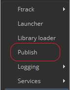
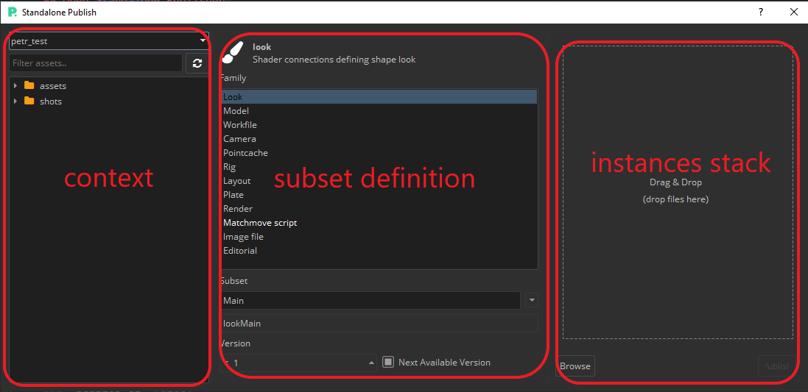
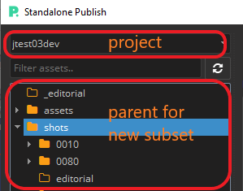

## Open Standalone Publisher

Standalone publisher can be opened from the Pype Tray menu > Publish



## Sections of Gui



### Context

To define what context should be instances processed into.

### Subset definition

Each subset is having defined `family` in which publish plugins are filtered.
Subset name is formed with the `family` name and connected `Subset` input field. Ther result for Family `Camera` and Subset `Main` will be `cameraMain`.

### Instances stack

Drag'n'drop area for a file needed to be published or `Browse` button could also be used for loading any instances.

## Defining Hierarchy

By setting target context the hierarchy is defined unless you are using _Editorial_ family workflow where hierarchy could be bypassed with `CollectHierarchyInstance` onto any Anatomy templated form.



## Configuration of individual family plugins

path: `pype-config/presets\plugins\standalonepublisher\publish.json`

<br></br>

### `Editorial` [subset definition > family]

This family is expecting to have instance of EDL in stack. Either one or multiple `.edl` files could be loaded in case multi layer workflow is applied.
There are two workflows which could be used:

-   single video file trimming (SVFT)
-   multi relative files (MRF) with use of `source_dir` attribute  

### `CollectEditorial`

#### Attributres:

-   **extensions**: list of extensions which are used for SVFT.
-   **source_dir**: path to directory in MRF to be searching for relative files. Searching patterns for expected subset name alternatives are defined in `CollectInstances`.

#### Example of use:

##### Path:

-   relative path from EDL file: `./pathToDir` and `../pathToDir`
-   absolute path: `C:/path/to/dir/with/inputs`
-   pype anatomy template path: `{project[name]}/pathToDir`

##### Name convention:

Name of clips in `.edl` should be corresponding with either directory name in `./source_dir/[clipName]/` or a single file name `./source_dir/[clipName]_[subsetName].[ext]`. So if name of clip in EDL is **clip01** then folder name should start with `clip01` or in case of file `clip01_plateReference.jpg`

```json
{
  "CollectEditorial": {
    "extensions": [".mov", ".mp4"],
    "source_dir": "./inputs"
  }
}
```

### `CollectInstances`

#### Attribures:

-   **subsets**: Dictionary with a subset profiles used within MRF and SVFT. By default SVFT workflow is used
-   

#### Subset's Attributes:

-   **subsetName**: key which is defining subset name as it will apparel in database
-   **subsetName.family**: main family. This will be shown in Loader
-   **subsetName.families**: list of additional families
-   **subsetName.extensions**: list of extension (with dot)
-   **subsetName.[attrName]**: any attribute we want to add to instance.data

#### Example of use:

Each of MRF and SVFT workflows are having different way of approaching subset creation. SVFT way is having more simple use as it is directly applying defined set of attributes to a new instance and trimming only part of input video file with FFMPEG. On the other hand the MRF way is trying to find any available alternatives of subset name in folders or files or collection of files. Here only one extension is needed.

##### SVFT use:

SVFT way is having more simple use as it is directly applying defined set of attributes to a new instance. Here only one extension is needed. Example bellow is showing default preset which part of the plugin and no need for defining those in plugin preset.

```json
{
  "subsets": {
    "referenceMain": {
        "family": "review",
        "families": ["clip", "ftrack"],
        "extensions": [".mp4"]
    },
    "audioMain": {
      "family": "audio",
      "families": ["clip", "ftrack"],
      "extensions": [".wav"],
    },
    "shotMain": {
        "family": "shot",
        "families": []
    }
  }
}
```

##### MRF use:

MRF way is more universal as it is using the key and its set of attributes as searching patterns for finding matching folder or file or collection of files.

If `["ftrack", "review"]` is added to **subsetName.families** the subset will be then added to ftrack with preview video. Video could be generated with FFMPEG from any supported image sequence or video file. If a MP4 is in **subsetName.extensions** then it is just simply passed and no need for FFMPEG conversion.

If `.jpg` is added to **subsetName.extensions** and any variant of word with `thumb` is found in name of single file then this will be used as thumbnail for the new version of subset.

```json
{
  "subsets": {
    "plateMain": {
      "family": "plate",
      "families": ["clip"],
      "extensions": [".exr", ".dpx", ".mp4", ".jpg"]
    },
    "plateOffline": {
      "family": "plate",
      "families": ["clip", "review", "ftrack"],
      "extensions": [".jpg", ".mp4", ".mov"]
    },
    "artReference": {
      "family": "image",
      "families": [],
      "extensions": [".jpg", ".psd"]
    },
    "shotMain": {
      "family": "shot",
      "families": []
    }
  }
}
```

### `CollectHierarchyInstance`

#### Attribures:

-   **shot_rename_template**: Anatomy template string formatted with contextual data of selected parents and keys defined in **shot_rename_search_patterns**
-   **shot_rename_search_patterns**: formatting pairs key and value as regex search patterns
-   **shot_add_hierarchy.parents_path**: template string formatted by **shot_add_hierarchy.parents** keys. Order of parts divided by '/' is used for forming hierarchy.
-   **shot_add_hierarchy.parents**: formatting pairs where key is used for formating of parents_path and its values are Anatomy template formattable strings which are formatted by contextual data of selected parents and keys defined in **shot_rename_search_patterns**
-   **shot_add_tasks**: list of task names which should be based on task type (example: task type _Compositing_ will match "compositing_environment")

#### Example of use:

```json
{
  "shot_rename_template": "{project[code]}_{_sequence_}_{_shot_}",
  "shot_rename_search_patterns": {
    "_sequence_": "(\\d{4})(?=_\\d{4})",
    "_shot_": "(\\d{4})(?!_\\d{4})"
  },
  "shot_add_hierarchy": {
        "parents_path": "{project}/{folder}/{sequence}",
        "parents": {
            "project": "{project[name]}",
            "sequence": "{_sequence_}",
            "folder": "shots"
        }
  },
  "shot_add_tasks": ["animation_rig", "compositing_environ", "compositing_all", "Art"]
}
```
